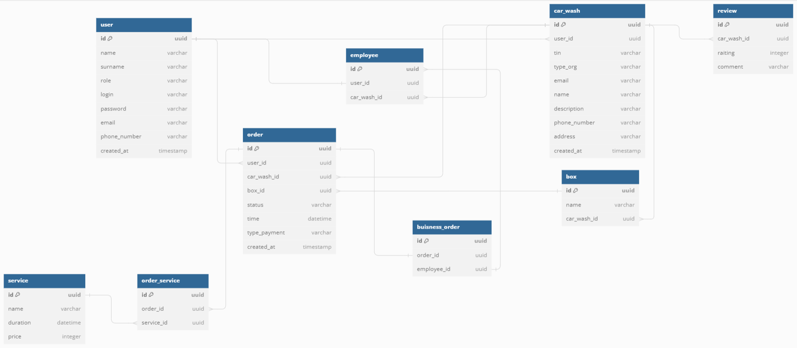
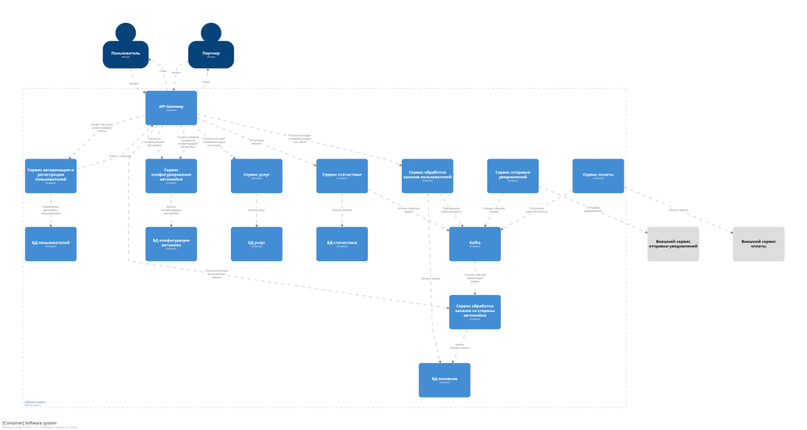

Архитектура приложения

## Архитектура баз данных

## Архитектура приложения

В рамках микросервисной архитектуры были созданы:
* **gateway** - шлюз, через который проходят все запросы, если запрос требует авторизации то он перенаправляется на
сервер авторизации
* **authorization-server** - сервер авторизации, где происходит передача JWT токена авторизации пользователя
* **configuration-service** - сервис обработки конфигураций автомоек
* **service-of-services** - сервис обработки услуг
* **statistics** - сервис сбора статистики
* **order-service** - сервис обработки заказов пользователей
* **business-order-service** - сервис обработки заказов со стороны автомойки
* **notification-service** - сервис отправки сообщений пользователям
* **storage-service** - сервис хранилища фотографий